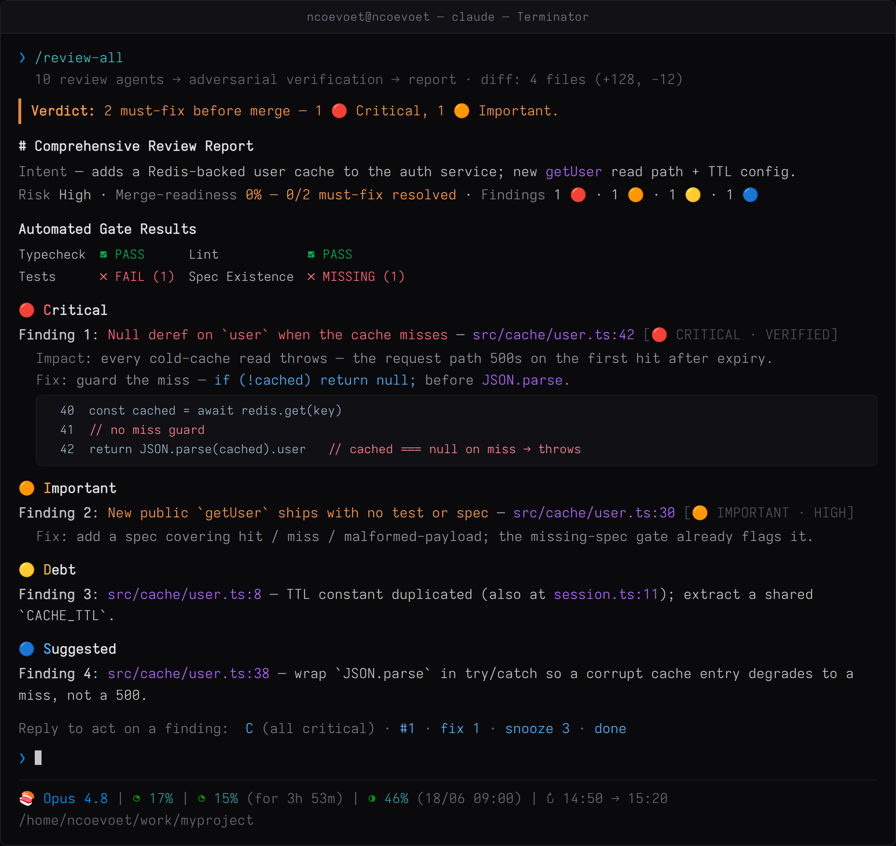

# /review-all

[](https://github.com/ncoevoet/claude-review-all/actions/workflows/ci.yml)
[](.claude-plugin/plugin.json)
[](LICENSE)
[](https://code.claude.com/docs/en/plugins)

Project-agnostic code review for [Claude Code](https://code.claude.com/docs/en/overview). One slash command runs deterministic gates, ten parallel review agents, and an adversarial verification pass. Every finding cites `file:line` and is independently re-checked before the report — false positives stay out.

## Demo



One verdict line up top, automated gate results, then findings by severity — Critical/Important carry full anatomy (impact · suggested fix · evidence), Debt/Suggested collapse to one line each. Every finding cites `file:line` and is independently re-verified before it reaches the report.

## Severity tiers

- **🔴 CRITICAL** — Breaks functionality, exposes data, crashes systems, violates requirements
- **🟠 IMPORTANT** — Missing error handling, unhandled edge cases, potential bugs
- **🟡 DEBT** — Code duplication, convention violations, refactoring needed within 6 months
- **🔵 SUGGESTED** — Measurable improvements only. If you can't measure the improvement, don't suggest it.
- **⚪ QUESTION** — Items requiring human judgment about requirements or intent

## Install

### Plugin (recommended)

Inside Claude Code, add the marketplace and install the plugin:

```
/plugin marketplace add ncoevoet/claude-review-all
/plugin install review-all@ncoevoet-review-all
```

`/review-all` is available right away. Update later with `/plugin update review-all@ncoevoet-review-all`, remove with `/plugin uninstall review-all@ncoevoet-review-all`. CLI equivalents work too: `claude plugin marketplace add ncoevoet/claude-review-all` then `claude plugin install review-all@ncoevoet-review-all`. The plugin bundles the skill's `scripts/` and resolves them relative to the skill, so it works wherever Claude Code installs it.

### Manual (`make install`)

For hacking on the skill itself, copy it straight into `~/.claude/skills/`:

```bash
git clone https://github.com/ncoevoet/claude-review-all.git
cd claude-review-all
make install   # copies skills/review-all/ → ~/.claude/skills/review-all/
```

`make uninstall` removes it. `make review-self` installs then reminds you to run `/review-all` in this repo. The skill works in Claude Code only — it depends on filesystem access and bash.

## Use

Inside Claude Code, run `/review-all` with any of these targets:

| Argument | Reviews |
|---|---|
| _(empty)_ | Uncommitted changes if any, else current branch vs default branch, else last commit |
| `--staged` | Only staged changes |
| `--unstaged` | Only unstaged changes |
| `last commit` | `HEAD~1..HEAD` |
| `last N commits` | `HEAD~N..HEAD` |
| `vs <branch>` | Current branch vs merge-base with `<branch>` |
| `<sha1>..<sha2>` | A specific commit range |
| `PR #N` or `#N` | A GitHub PR (requires `gh`) |
| _file paths_ | Restrict review to those files |
| `--paths a/b,c/d` | Filter resolved diff to these path prefixes |
| `--exclude x,y` | Drop these path prefixes from the resolved diff |
| `gate` / `--ci` | **Headless gate mode** — full review, then a machine verdict (`gate-verdict.json` + exit code) with no Phase 4 menu; composes with any target (`gate --staged`, `gate PR #N`) |

Examples:

```
/review-all
/review-all --staged
/review-all PR #123
/review-all last 3 commits
/review-all vs main
/review-all src/auth/login.ts src/auth/session.ts
/review-all PR #42 --exclude apps/legacy
/review-all gate --severity critical
```

## How it works — exact steps

### Phase 0 — Project discovery

| Step | What it does | Why |
|---|---|---|
| 0.0 Discovery (one call) | Runs `scripts/discover.sh` — composes the preflight tool probe (`git`/`timeout`/`lsof`/`ss`/`gh`/`jq`/`curl`/`rsync`/`python3`), toolchain detection, test-pattern detection, `.codegraph/` check, and the rules-cache verdict in a SINGLE script call | Phase 0 costs one round trip regardless of cache state; later phases degrade instead of crashing on a missing tool |
| 0.1 Resolve target | Parses `$ARGUMENTS` against the table above | Single source of truth for "what diff is being reviewed" |
| 0.2 Load config + rules cache | Reads `.claude/review-all.json`; on cache HIT reuses the LLM-extracted global rules from `.claude/cache/review-all-profile.json` | Only the expensive LLM work (rules extraction) is cached — toolchain commands are re-probed fresh every run, so a `package.json`/`pom.xml` change can never be served stale |
| 0.3 + 0.4 Toolchain | Folded into 0.0 — `detect-toolchain.sh` emits `{ecosystem, framework, test, lint, typecheck, build}` | Project-agnostic gate commands; never assumes Angular vs Spring vs Rust |
| 0.5 Project rules | Reads root + nested CLAUDE.md files; the global half is skipped on cache HIT, module-level CLAUDE.md (changed dirs) always read fresh | "NEVER do X / ALWAYS do Y" steer the agents |
| 0.6 Test patterns | Folded into 0.0 — `test-pattern-probe.sh` infers location, suffix, framework | Spec Existence Check uses this; no hardcoded `__tests__` assumption |
| 0.7 CodeGraph + MCP | Probes the live MCP tool registry (skipped entirely when 0.0 found no `.codegraph/`); records `toolchain.codegraphTools` keyed by capability | Tool names are not hardcoded — survives MCP-server renames |
| 0.8 Gather diff | Computes diff + per-file slice, applies `--paths`/`--exclude`, recent commit log | Filter is enforced before any agent sees the diff |
| 0.9 Output dirs + cache write | Creates `.claude/cache`, `.claude/reports`, `.claude/review-all`; on cache MISS writes the v2 rules profile | First run on a fresh repo never crashes on a missing dir |

The rules cache is keyed on a manifest of per-file content hashes over every repo `CLAUDE.md` (+ root `CLAUDE.local.md`), carries a schema version, and expires after 7 days — a branch switch, a CLAUDE.md edit, or a legacy cache file all force a fresh extraction. The report's gate table shows `Profile cache: HIT / MISS(reason)` so cache behavior is always visible (and eval-gradeable).

### Phase 1 — Deterministic gates (in parallel)

| Gate | Command | Why |
|---|---|---|
| Typecheck | `timeout 120 <discovered>` | Compilers find what review can't |
| Lint | `timeout 120 <discovered>` | Style + simple bugs at zero token cost |
| Tests | `timeout 180 <scoped>` | Smart scoping: tests that import changed files first, fallback to package, fallback to suite |
| Dev-server probe | `scripts/dev-server-probe.sh` | If dev server is up, **skip** the build gate — it's already running |
| Spec existence | per new file vs `toolchain.testPattern` | New public code without tests is automatically 🔴 |
| Dependency check | per manifest diff | New deps / major bumps / removed deps surface explicitly |

Gate-confirmed findings are tagged `VERIFIED` and skip the verification phase. They are real, by definition.

### Phase 1.5 — Runtime probe (optional, self-skipping)

If a UI file changed AND a dev-server port is open AND `curl` exists:

1. Health-check each port (3× with 2s backoff to absorb dev-server warm-up).
2. If Playwright/Puppeteer is installed and a baseline screenshot exists, headless-screenshot the changed routes and pixel-diff against baseline.

Catches dead routes and visual regressions that static review cannot.

### Phase 2 — Parallel agents

Ten specialized agents review the (filtered) diff slice in parallel, each on its own concern:

`standards · bugs+security · DRY · consistency · simplification · security-deep-dive · performance · test-quality · API-contract · a11y/i18n`

Agents share `_shared.md` (severity tiers, 3-question gate, quotas, auto-drop rules, codegraph-tool resolution).

Big diffs are auto-chunked (`chunkMaxFiles=40`, `chunkMaxBytes=200000`) and re-merged by `root_cause_key`.

### Phase 2.5 — Dedupe → adversarial verify

1. **Dedupe** via `scripts/dedupe.py`: groups by `root_cause_key`, annotates `confirmed_by`, applies global caps (SUGGESTED ≤ 10, QUESTION ≤ 8).
2. **Verify** in parallel — one verifier per source agent, spawned at `verifierModel` tier (default Haiku — cheap, fast, JSON-bound). Verifier stance is **hostile to the finding, not the code**: assume every finding is wrong until disproven. Its primary gate is a **citation check** — a behavior claim must be provable from a quoted source line, not inferred from naming; ungrounded claims are dropped (or kept only as a ⚪ question). Top severity (🔴/🟠) must be earned by that proof.
3. Score: `≥75` → main report, `50–74` → appendix, `<50` → silently dropped.
4. **State sweep** via `scripts/state-sweep.py`: applies `fixed`/`stale`/`snoozed`/`wontfix` transitions to `.claude/review-all/state.json`.

### Phase 2.75 — Completion gate

Every spawned agent and every verifier must have returned with valid JSON, or be explicitly retried once, or be surfaced as `⚠️ PARTIAL REVIEW` in the report. No silent drops.

### Phase 3 — Unified report

Opens with a one-line **Verdict** (`N must-fix before merge`, or ✅ none) for instant triage, then: Intent · Summary · Gate Results · 🔴 Critical · 🟠 Important · 🟡 Debt · 🔵 Suggested · ⚪ Questions · Dependency Changes · Appendix · **Scope footer** (files reviewed / skipped). 🔴/🟠 get full anatomy (failure-mode title, `[severity · confidence]` tag, one-sentence impact, suggested fix, ≤8-line evidence); 🟡/🔵/⚪ collapse to one line each. The Summary also reports a **Merge-readiness %** (a transparent resolved/total must-fix ratio that climbs as fixes apply) and **change-type buckets** (files Added/Modified/Deleted/Renamed). The last line is a machine-readable `<!-- review-all-severity: {…} -->` comment for CI parsing; the Phase 4 **Export findings** action additionally emits `review-<ts>.json` + `review-<ts>.sarif` for CI gates.

Heartbeat lines print at each phase boundary so the user sees forward motion on long runs.

### Phase 4 — Post-report menu

Presenting the menu is a **mandatory closing step** — a finished report is the *start* of Phase 4, not the end of the turn (skipped only when every section says "None found." with no appendix). Ordering is a hard rule: the full report renders as text first, then the menu immediately after it with zero tool calls in between — so the menu can never appear before (or without) the report — and the menu's question line repeats the verdict summary in case the report has scrolled off-screen. The primary menu (`AskUserQuestion`, single-select, ≤4 options) offers four **modes**:

- **Fix by scope…** — apply by severity scope (critical / +important / +debt) or a **Custom** expression mixing severity letters and finding IDs/ranges (e.g. `I D #11`, `1-7, 11`).
- **Triage one-by-one** — walk each must-fix finding with a per-finding micro-menu (Fix · Ask · Create ticket · Snooze · Wontfix · Skip).
- **More actions…** (multi-select) — Save full report · **Ask a follow-up question** · **Generate tests** · **Create a ticket/issue** · **Export findings (JSON + SARIF)** · Deep-dive · Generate fix patches · Draft commit/PR · Post to GitHub PR · Snooze · Wontfix · Schedule re-review · Re-run on fixed code.
- **Skip / done.**

The two fix modes appear only when fixable findings exist; otherwise the menu leads with **More actions…** so the non-fix choices stay reachable (this is the fix that restored discoverability). After a clean apply-fixes (all post-fix gates pass), an **auto-delta** scoped review runs against the just-edited files and appends a `## Post-fix delta` section.

### Gate mode — headless verdict (CI / autonomous loops)

`/review-all gate` (or any target with `--ci`) runs Phases 0–2.75 unchanged, then **replaces the Phase 3 report and Phase 4 menu with a machine-readable verdict** — no prose, no `AskUserQuestion`. It writes `.claude/review-all/gate-verdict.json`, prints the same JSON, and exits `0` (pass) / `1` (blocked) / `2` (malformed):

```json
{ "pass": false, "severityFloor": "critical", "partial": false, "blockingCount": 1,
  "blocking": [ {"id": "F3", "severity": "CRITICAL", "file": "src/x.ts", "line": 42, "title": "unguarded null deref"} ] }
```

A finding blocks only when its severity meets the floor (`gateSeverityFloor`, default `critical` → 🔴 only; `--severity important` → 🔴+🟠). Only main-report findings (score ≥ 75) gate — the appendix never blocks. Partial review coverage **fails closed**. This is what lets a CI step or an autonomous loop (e.g. the `goal-loop` plugin's oracle) consume review-all as a hard gate. See `skills/review-all/references/phase-gate.md`.

## How it's tested & improved

Every change to this skill is **eval-driven** — the same develop-tests loop Anthropic recommends for agent harnesses:

- **89 labeled scenarios** (`skills/review-all/evals/*.json`) across Java, TypeScript, Python, SQL, Go, and Rust. Most are *recall* cases (a planted real bug the review must catch: races, leaks, injections, N+1s, broken contracts…); a growing set are **precision counter-cases** — correct code that looks suspicious (an intentional `except Exception` boundary, a consistent lock discipline, a neutralized CSV export, a TODO comment) that must **NOT** become a finding. Two cases exercise gate mode end-to-end; two guard the profile cache (a poisoned legacy cache must MISS, a valid warm cache must HIT *and* still apply its rules).
- **Headless LLM-graded runner** (`scripts/run-evals-headless.sh`): each fixture is materialized into a throwaway git repo, `/review-all` runs there via `claude -p`, and a second LLM call grades the report against the case's rubric. Single runs flicker (LLM output is non-deterministic), so trustworthy baselines use `REVIEW_ALL_EVAL_RUNS=3+` and compare pass-*rates*.
- **A/B before shipping**: persona or verifier edits are measured against the relevant eval subset with and without the change — a change that doesn't move recall without hurting precision is reverted. `scripts/eval-scorecard.py` turns the runner's per-case `RESULT`/`SCORE` lines into a suite-level **recall % / precision % / F1 / SNR** scorecard, so an A/B diffs an aggregate precision number, not just per-case PASS rates (the SNR is an honest suite-derived proxy, not a CR-Bench per-comment metric).
- **No-API CI gates** on every push (`tests/run.sh`): anonymization check (no real project names in fixtures), eval-schema validation, shellcheck on all scripts, Python unit tests, and a static doc-invariant gate for the Phase 4 menu (`tests/check-phase4-menu.sh`) — the menu can't be exercised headlessly, so its invariants are grepped from the published docs instead.
- **Every real-world escape becomes a case**: a missed bug or a false positive observed in actual use is converted into a new eval before the fix lands, so it can never regress silently.

See `skills/review-all/evals/README.md` for the schema, the full scenario list, and the iteration loop.

## Pros / Cons

| Pros | Cons |
|---|---|
| **No false positives by design** — every finding survives adversarial re-read | Two-pass model (agents + verifier) costs more tokens than a single-shot review |
| **Project-agnostic** — discovers conventions from the repo, never assumes them | Discovery probes run on every review (one script call, ~1s); only the CLAUDE.md rules extraction is cached — by design, so toolchain data is never stale |
| **Filtered scope** — `--paths`/`--exclude` and interactive workspace pruning honor the user's actual focus | The multi-workspace prompt only fires above 50 files / multiple roots — adjust expectations on small repos |
| **Deterministic ops in scripts** — preflight, toolchain, test-pattern, dev-server, dedupe, state-sweep all live in `scripts/`. Reliability + token savings + auditable | Requires bash + Python 3 on the developer machine (default on macOS/Linux; fine in WSL) |
| **Hostile verifier on Haiku** — cheap, fast, no confirmation bias | Verifier mis-scoring on truly novel patterns can hide a real finding in the appendix — escape via `verifierModel: "sonnet"`, or `verifierVotes: 3` to majority-vote 🔴/🟠 across independent passes |
| **Lifecycle-aware** — snoozed/wontfix/stale tracked in `state.json`; dismissed findings are fed back to the agents as a `<previously_dismissed>` digest so the team's own wontfix decisions aren't re-derived; recurring findings auto-escalate after 3 sightings | State file is per-repo; not shared across team members. Intentional — comments are the team-wide channel |
| **Plugin-free install** — `make install` and you're done | Not portable to claude.ai uploads or the Claude API runtime (uses git/gh/bash/filesystem). Claude Code only |

## Optional configuration

Drop a `.claude/review-all.json` into any project to tune behavior. All keys optional; documented defaults apply when absent. See `skills/review-all/references/config-keys.md` for the full table with per-key rationales.

Common keys:

```json
{
  "devServerPorts": [4200, 5173, 3000],
  "verifierModel": "haiku",
  "verifierVotes": 1,
  "extraAgents": [],
  "skipAgents": []
}
```

`verifierVotes` defaults to `1` (single hostile pass). Set it to an odd `N>1` (e.g. `3`) to majority-vote the 🔴/🟠 findings across `N` independent verifier passes — a finding reaches the main report only if ⌈N/2⌉ verifiers keep it. Voting is scoped to top severity (🟡/🔵/⚪ stay single-pass) and adds verifier cost only when 🔴/🟠 survivors exist; see `references/config-keys.md`.

### Finding-count caps

Two layers trim a report. Both are config-driven — set the relevant keys to `0` for a complete verified list. 🔴 CRITICAL / 🟠 IMPORTANT are never capped at any layer.

| Key | Default | Caps |
|-----|---------|------|
| `quotaDebt` | `5` | 🟡 DEBT findings **per agent** (dropped pre-dedupe) |
| `quotaSuggested` | `3` | 🔵 SUGGESTED findings **per agent** |
| `quotaQuestion` | `2` | ⚪ QUESTION findings **per agent** |
| `suggestedGlobalCap` | `10` | 🔵 SUGGESTED findings **globally**, after dedupe |
| `questionGlobalCap` | `8` | ⚪ QUESTION findings **globally**, after dedupe |

To get every verified finding, zero out both layers for the tier — a per-agent quota drops findings *before* dedupe, so a global cap alone cannot recover them:

```json
{
  "quotaDebt": 0,
  "quotaSuggested": 0,
  "quotaQuestion": 0,
  "suggestedGlobalCap": 0,
  "questionGlobalCap": 0
}
```

`/review-all init` walks an interactive wizard that writes a populated config.

## Optional: CodeGraph

If a CodeGraph MCP server is wired into Claude Code and the project has a `.codegraph/` directory, `/review-all` uses its tools for cross-file analysis (callers, callees, impact). Tool names are resolved at runtime, so any MCP namespace works. Without CodeGraph, the relevant agents fall back to `grep` / `git grep`.

## Requirements

- [Claude Code CLI](https://code.claude.com/docs/en/overview)
- `git`, `bash`, `python3` (defaults on macOS/Linux)
- `gh` — for `PR #N` review mode, and optionally for the Phase 4 *Post to GitHub PR* (`gh pr comment`) and *Create a ticket/issue* (`gh issue create`) actions; both are write-scoped and confirmation-gated, and Create-ticket falls back to writing an issue-markdown file when `gh`/GitHub isn't present

## Layout

```
claude-review-all/
├── skills/review-all/
│   ├── SKILL.md              # orchestrator entry point
│   ├── agents/               # 10 persona files + _shared.md + verifier.md
│   ├── references/           # per-phase rules, config schema, state-file lifecycle
│   ├── evals/                # labeled scenarios + success criteria + grader rubrics
│   └── scripts/              # discover (one-call Phase 0), preflight, detect-toolchain,
│                             # dev-server-probe, test-pattern-probe, dedupe, state-sweep,
│                             # gate-verdict, export-findings, validate-evals,
│                             # materialize-fixture, run-evals, run-evals-headless,
│                             # eval-scorecard (recall/precision/SNR aggregate)
├── tests/                    # unit tests + check-anonymization.sh (gitignored blocklist)
└── .github/workflows/ci.yml  # shellcheck + test suite (incl. anonymization + eval-schema gates)
```

All plain Markdown / shell / Python — read, fork, extend.

## Development

```bash
bash tests/run.sh            # anonymization gate + eval-schema validation + shellcheck-clean shell scripts + Python unit tests (no API key)
```

`tests/run.sh` runs four no-API gates: an **anonymization gate** (`tests/check-anonymization.sh` — fails if a real employer/product/ticket name leaks into published artifacts; the real blocklist is gitignored, a placeholder `*.example.txt` ships), **eval-schema validation** (`scripts/validate-evals.py` — every `evals/*.json` must have a non-empty `grader.rubric`, a materializable fixture, and an id matching its filename), the shell-script tests, and the Python unit tests. CI (`.github/workflows/ci.yml`) runs shellcheck + this suite on every push / PR. The eval suite under `skills/review-all/evals/` is materialized into throwaway git repos and LLM-graded headlessly by `scripts/run-evals-headless.sh` (needs the `claude` CLI); see `skills/review-all/evals/README.md`.

## License

MIT — see [LICENSE](LICENSE).
