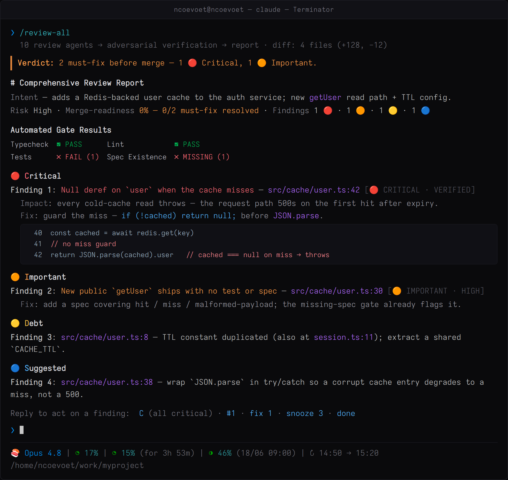

# /review-all

[](https://github.com/ncoevoet/claude-review-all/actions/workflows/ci.yml)
[](.claude-plugin/plugin.json)
[](LICENSE)
[](https://code.claude.com/docs/en/plugins)

Multi-agent code review for [Claude Code](https://code.claude.com/docs/en/overview), for any language or stack. It runs the repo's own typecheck/lint/tests, has up to ten review agents read the diff in parallel, then has a separate verifier re-check every finding before it reaches the report.



## Install

```
/plugin marketplace add ncoevoet/claude-review-all
/plugin install review-all@ncoevoet-review-all
```

Or, to hack on the skill: `git clone` this repo and run `make install`, which copies `skills/review-all/` to `~/.claude/skills/review-all/` (`make uninstall` removes it).

Requires Claude Code, `git`, `bash`, `python3`. `gh` is optional: it is used for `PR #N` targets and for the post-to-PR / create-issue actions.

## Use

| Argument | Reviews |
|---|---|
| _(empty)_ | Uncommitted changes, else current branch vs default branch, else last commit |
| `--staged` / `--unstaged` | Only staged / unstaged changes |
| `last commit`, `last N commits` | `HEAD~N..HEAD` |
| `vs <branch>` | Current branch vs merge-base with `<branch>` |
| `<sha1>..<sha2>` | A commit range |
| `PR #N` or `#N` | A GitHub PR (needs `gh`) |
| _file paths_, `--paths a,b`, `--exclude x,y` | Narrow the diff to / away from these paths |
| `gate` / `--ci` | Headless mode: JSON verdict and exit code, no menu (see [Gate mode](#gate-mode-ci)) |

```
/review-all
/review-all PR #123
/review-all vs main --exclude apps/legacy
/review-all gate --severity important
```

## How it works

1. **Discover.** One script (`scripts/discover.sh`) detects the toolchain, test layout and available tools. Rules extracted from `CLAUDE.md` are cached; toolchain data is re-probed every run.
2. **Deterministic gates.** Typecheck, lint and scoped tests run in parallel. New public code without a test is flagged. A failing gate becomes a finding directly, and its output is passed to the agents as a `<gate_results>` block.
3. **Select files and agents.** `select-files.py` drops binaries, secrets, generated/vendor output and oversized files before any agent runs. `select-agents.py` picks the axes: six always run; security deep-dive, test-quality, API-contract and a11y/i18n run only when the diff contains matching files. Skipped axes are named in the report.
4. **Review in parallel.** Axes: standards, bugs+security, DRY, consistency, simplification, security deep-dive, performance, test quality, API contract, a11y/i18n. Every spawn names its model: `opus` for behavioral axes (bugs, security, performance, API contract) and `sonnet` for the others. Each agent gets the diff in its own file order (`agent-order.py`), plus per-language rule packs from `rules/`. Completed axes are saved to `.claude/review-all/checkpoints/`, so an interrupted run picks up where it stopped.
5. **Dedupe and verify.** Findings are grouped by root cause (the report says "Flagged independently by N agents"). Then a verifier (Haiku by default) tries to disprove each one: a behavior claim has to be backed by a quoted source line. Findings scoring ≥75 go in the report, 50–74 in the appendix, and the rest are dropped.
6. **Claim classes.** A runtime, data or rendering claim that is backed only by reading the source gets the `unverified` verdict. It is shown in its own section with the observation that would settle it, and it never blocks a gate.
7. **Report.** It opens with a verdict line, then gate results with a **Provenance** column (command, exit code, time), then findings by severity. It ends with a machine-readable `<!-- review-all-severity: {…} -->` tally.
8. **Menu.** Fix by scope, Triage one-by-one, More actions (export JSON/SARIF, generate tests, ticket, post to PR, …), or done. After a fix, the changed files get a delta review.

Findings dismissed as `wontfix` or rejected by the verifier are stored in `.claude/review-all/state.json`. Later runs pass them to the agents as a `<previously_dismissed>` digest so they are not raised again. Details for each phase: `skills/review-all/references/`.

### Severity tiers

- **🔴 CRITICAL**: breaks functionality, exposes data, crashes, violates a requirement.
- **🟠 IMPORTANT**: missing error handling, unhandled edge case, likely bug.
- **🟡 DEBT**: duplication, convention violation, refactor needed soon.
- **🔵 SUGGESTED**: a measurable improvement only. If it can't be measured, it isn't suggested.
- **⚪ QUESTION**: needs a human decision about requirements or intent.

## Gate mode (CI)

`/review-all gate` runs the same review but replaces the report and menu with `.claude/review-all/gate-verdict.json`. Exit codes: `0` pass, `1` blocked, `2` malformed.

```json
{ "pass": false, "severityFloor": "critical", "partial": false, "blockingCount": 1,
  "blocking": [ {"id": "F3", "severity": "CRITICAL", "file": "src/x.ts", "line": 42, "title": "unguarded null deref"} ] }
```

By default only 🔴 findings block; `--severity important` makes 🟠 block too. Appendix and `unverified` findings never block. If any agent fails to return, the gate fails. See `references/phase-gate.md`.

## Use as a commit gate

The [workflow-kit](https://github.com/ncoevoet/claude-workflow-kit) plugin's `commit-gate-guard` skill uses review-all for a cheap check before each commit. It does not run `/review-all`. It spawns **one** `opus` agent and gives it this repo's **bugs+security persona** (`agents/02-bugs-security.md`) plus `agents/_shared.md`, with these inputs:

- the diff since the last commit that passed the gate, not only the staged changes;
- one sentence on what the change is meant to guarantee;
- for boolean guards or precedence chains, a request for a truth table over all inputs.

Why this persona: bugs+security is the axis that looks for behavioral defects, and `_shared.md` brings the severity gate and the claim-class cap along with it, so the single pass follows the same evidence rules as a full review. It skips the other nine axes, the verifier, the report and the menu. The commit is blocked on any 🔴/🟠 finding. When review-all is not installed, the gate falls back to a short inline brief.

This couples the two plugins: **an edit to `02-bugs-security.md` or `_shared.md` also changes every repo's commit gate.**

| | `/review-all gate` | `commit-gate-guard` |
|---|---|---|
| Scope | Full review, all selected axes | Delta since last passing commit |
| Agents | Up to 10 + verifier | 1, no verifier |
| When | CI, autonomous loops | Every `git commit` |

## How it was built

The skill grew out of several years of daily use of Claude for code review on real work projects. The rules in the personas and in `_shared.md` mostly come from specific failures: a missed bug or a false positive seen in real use, turned into a rule, and since this repo was published (May 2026), turned into an eval case before the fix lands. The commit history since then shows that eval-driven phase, including the changes that were reverted.

## How it's tested

**Eval suite.** There are 98 labeled cases in `skills/review-all/evals/`: 44 TypeScript, 20 Java, 11 Python, 5 Go, 4 SQL, 4 Rust. Most are recall cases, where a planted bug (race, leak, injection, N+1, broken contract…) must be reported. The rest are precision cases, where correct code that looks suspicious must not be flagged. Some cases cover gate mode, the rules cache, `REVIEW.md`, a toolchain whose tests really fail, and dismissal state that carries across runs.

**Runner.** `scripts/run-evals-headless.sh` builds each fixture into a throwaway git repo and runs `/review-all` there with `claude -p`. A second LLM call then grades the report against the case's rubric. `eval-scorecard.py` adds up recall, precision and F1. Runs use `REVIEW_ALL_EVAL_RUNS=3` or more and compare pass rates, because a single run is noisy. `REVIEW_ALL_EVAL_MODEL` pins the model so two runs can be compared.

**A/B before shipping.** A change to a persona or the verifier is run on the relevant cases with and without the change. If it gives no gain, it is reverted. A case only counts as evidence if the version without the change actually fails it. This rule has led to reverting shipped-looking work: a doc-staleness rule and a set of severity-inflation rules were dropped because the baseline already passed their cases.

**Known limits.**
- The grader is an LLM.
- At N=3, a 2/3 result cannot be told apart from 3/3. Cases `01` and `02` vary too much on identical code to use for A/B.
- Some features shipped **unmeasured**: per-agent diff ordering, remembering verifier rejections, and the v0.10.2 observation rule. [`evals/README.md`](skills/review-all/evals/README.md) and the release commits say which, and why.
- Savings from skipping work (fewer agent or verifier calls) do not show up in the report, so a report-grading harness cannot measure them.

**CI without an API key** (`bash tests/run.sh`, on every push):
- a check that no real project names appear in fixtures;
- eval schema validation;
- shellcheck;
- 13 Python unit-test files;
- 14 `tests/check-*.sh` doc gates.

Behavior that exists only as instructions cannot be run headlessly, so each doc gate greps the docs for the key sentence. Each gate was checked by deleting that sentence on a scratch copy and confirming the gate fails.

## Project rules

Rules come from four places. Only the first two are read from your repo; the last two live inside the skill.

| Source | Scope | Freshness |
|---|---|---|
| Root `CLAUDE.md` (+ files it references, + root `CLAUDE.local.md`) | Whole repo: naming, architecture, "NEVER X / ALWAYS Y" | Rules extracted by an LLM, cached for 7 days, re-extracted when any `CLAUDE.md` changes |
| `CLAUDE.md` in a changed file's directory | That module only | Read on every run |
| `REVIEW.md` at the repo root | What to flag and at what severity; wins over everything else | Read on every run, injected verbatim (see below) |
| Language rule packs (`skills/review-all/rules/`) | Mistakes a language tends to produce, and false positives to avoid | Part of the skill |

`~/.claude/CLAUDE.md` is ignored: it describes you, not the project.

### Language rule packs

The skill ships packs for TypeScript/JavaScript, Java, Python, Go, Rust, SQL, JSON and Markdown, plus `default.md` for everything else. `scripts/file-classes.json` maps file globs to packs (`"**/*.go": "go.md"`). Each agent gets the packs for the languages in its part of the diff, one copy per language, as a `<language_rules>` block. Set `"languageRules": false` to turn them off, for example when your `REVIEW.md` already covers the same ground.

To add a language, or tighten an existing pack:

1. Write `skills/review-all/rules/<lang>.md`. Terse bullets, defects only (correctness, resources, concurrency, security), max 60 lines. It must end with a `#### Do not report` section of at least 4 false positives.
2. Add the glob to `rule_packs` in `skills/review-all/scripts/file-classes.json`, above the `**/*` catch-all.
3. Run `bash tests/check-rule-packs.sh`.

There is no per-project pack directory: packs are part of the skill. Make the change in a clone and `make install` it, or send a PR. Edits made inside the plugin cache are lost when the plugin updates. For rules that apply to one project only, use `REVIEW.md` or `CLAUDE.md`.

### Custom agents

`"extraAgents": ["my-axis"]` spawns `skills/review-all/agents/my-axis.md` on every run, on top of the automatically selected axes. It runs at `sonnet` unless its frontmatter declares a `model:`. Its findings go through the same verifier. `"skipAgents"` turns an axis off.

## Review instructions

A `REVIEW.md` at the repo root changes what gets flagged, and at what severity. It is read on every run (never cached) and injected as the top-priority block into every agent and the verifier.

```markdown
## Raise the bar per path
- In `scripts/`, only report if near-certain and severe.
- In `src/payments/`, treat any missing error handling as 🔴 CRITICAL.

## Do not report
- Anything CI already enforces: lint, formatting, type errors
```

- **Verbatim means verbatim.** The file is never summarized, and `@`-imports are not expanded. Keep it short, since it goes into every prompt (the review warns above 10 KB).
- It controls what is reviewed, not what counts as proof. A finding it promotes still has to be proven at that severity.
- In gate mode it can move findings above or below the blocking floor. When `REVIEW.md` itself changes in the diff, the gate summary says so.

## Configuration

`.claude/review-all.json` is optional, and every key has a default. `/review-all init` walks you through creating it.

```json
{ "verifierModel": "haiku", "verifierVotes": 1, "skipAgents": [], "extraAgents": [],
  "quotaDebt": 5, "quotaSuggested": 3, "suggestedGlobalCap": 10, "maxFileDiffBytes": 160000 }
```

- `verifierVotes: 3` has three verifier passes vote on 🔴/🟠 findings.
- Set the quota and cap keys to `0` to get every verified finding (🔴/🟠 are never capped).
- File exclusion patterns are in `scripts/file-classes.json`. Test files, `.md` and deleted files are always reviewed.
- Full key table: `references/config-keys.md`.

If the repo has a `.codegraph/` index and a CodeGraph MCP server is connected, agents use it for callers and impact analysis. Otherwise they use `git grep`.

## Limits

- Costs more tokens than a single-pass review, because both the agents and the verifier run.
- The Haiku verifier can mis-score a new kind of pattern and push a real finding to the appendix. `verifierModel: "sonnet"` or `verifierVotes: 3` reduce this.
- `state.json` is per repo and per machine. It is not shared across a team.
- Claude Code only: it needs git, bash and filesystem access.

## Development

```bash
bash tests/run.sh    # no API key needed
```

Eval schema, the case list and the iteration loop: [`skills/review-all/evals/README.md`](skills/review-all/evals/README.md).

## License

MIT — see [LICENSE](LICENSE).
